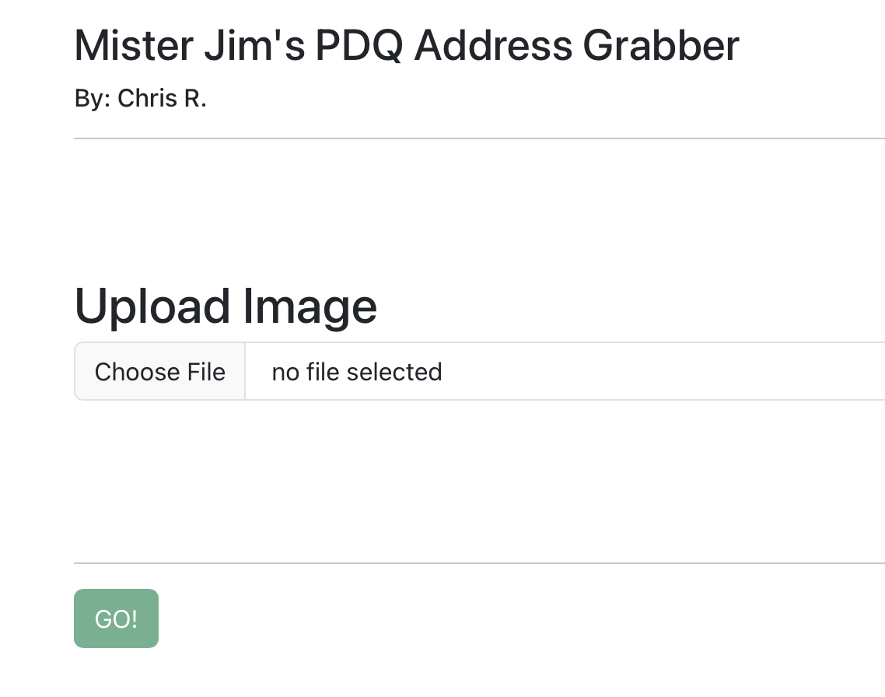
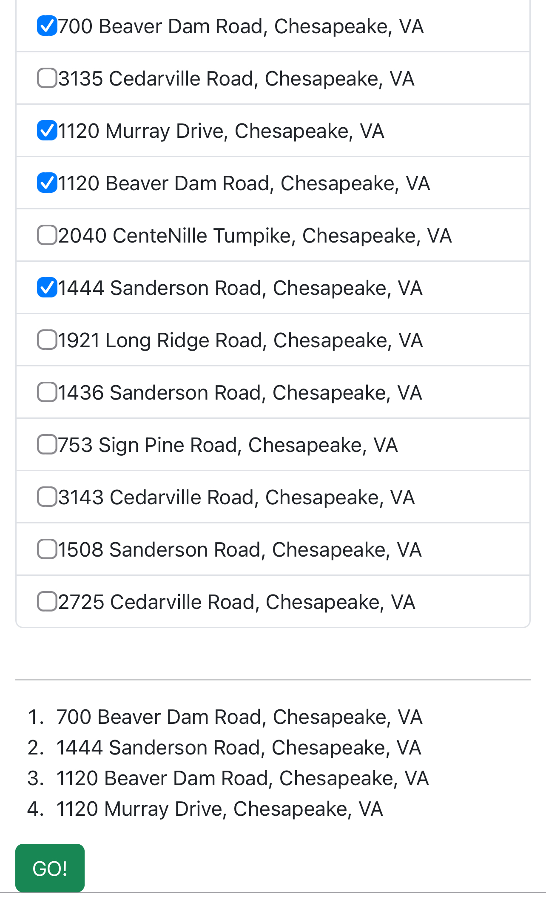
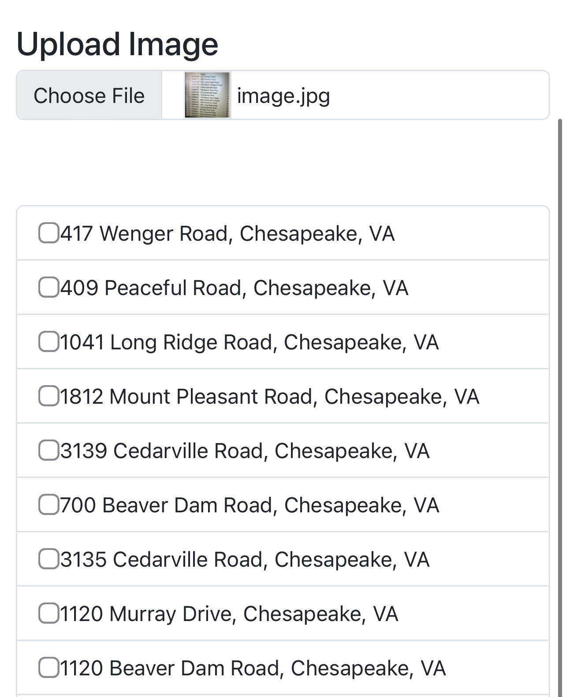
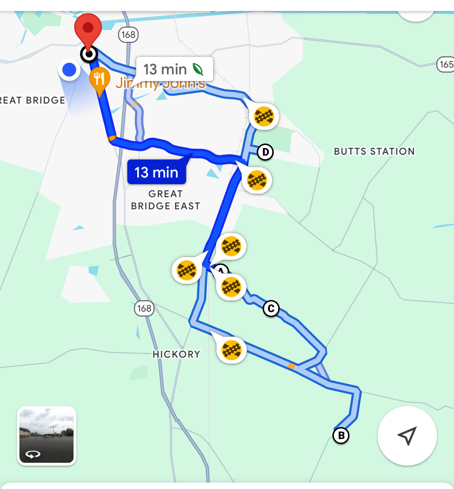

# Address-extractor
This application uses OCR API to extract addresses from a screen or printout and gives the user ability to order the addresses into a route and send the route to google maps. Currently the start and stop location are set to be a delivery restaurant called Mister Jim’s in Chesapeake, VA

